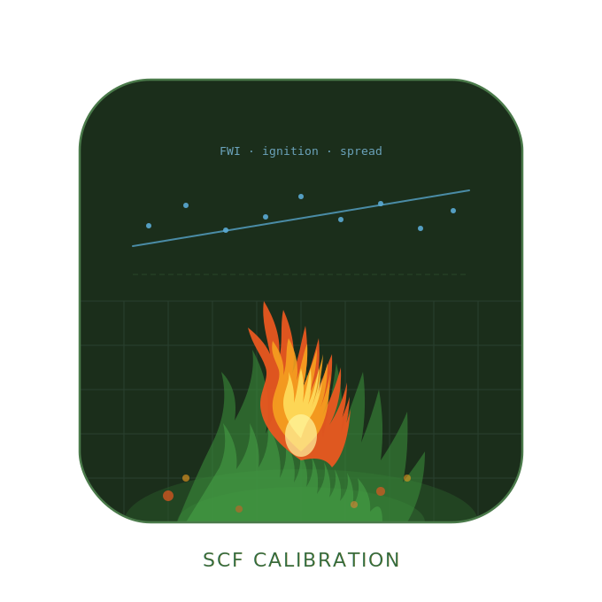

<p align="center">
  
</p>

# SCF Fire Calibration Shiny App

An interactive R Shiny application for calibrating the
[LANDIS-II Social-Climate-Fire (SCF) v4](https://github.com/LANDIS-II-Foundation/Extension-Social-Climate-Fire)
extension. The app derives ignition coefficients, spread probability
coefficients, maximum daily spread area coefficients, site mortality
parameters, bark thickness parameters, and all required spatial maps
directly from publicly available fire and climate data.

---

## Contents

1. [Quick Start](#1-quick-start)
2. [Required Data](#2-required-data)
3. [App Structure](#3-app-structure)
4. [Sidebar — Landscape Setup](#4-sidebar--landscape-setup)
5. [Tab 1 — Ignition Calibration](#5-tab-1--ignition-calibration)
6. [Tab 2 — Species Table](#6-tab-2--species-table)
7. [Tab 3 — Spread Calibration](#7-tab-3--spread-calibration)
8. [Tab 4 — Parameter Tuning](#8-tab-4--parameter-tuning)
9. [Tab 5 — Model Validation](#9-tab-5--model-validation)
10. [SCF Parameter Mappings](#10-scf-parameter-mappings)
11. [Output Files Reference](#11-output-files-reference)
12. [Troubleshooting](#12-troubleshooting)
13. [Data Sources & Citations](#13-data-sources--citations)

---

## 1. Quick Start

### Prerequisites

- R ≥ 4.4.0 and RStudio (recommended)
- The `renv` package for reproducible package management

### Installation

```r
# 1. Clone the repository
#    git clone https://github.com/jameslamping/Shiny_SCF_Calibration

# 2. Open app.R in RStudio — renv activates automatically via .Rprofile
#    OR from the R console in the project directory:

install.packages("renv")          # if not already installed
renv::restore()                   # installs all packages at exact locked versions
                                  # (~5–10 min on first run)

# 3. Launch the app
shiny::runApp()
```

`renv::restore()` reads `renv.lock` and installs every package at the exact
version used during development — including GitHub-sourced packages (`rFIA`,
`climateR`, `ncmeta`). This ensures the app runs identically regardless of
future package updates.

To update the lockfile after adding or upgrading packages:

```r
renv::snapshot()
# then commit renv.lock
```

---

## 2. Required Data

The app relies on several large external datasets that are too big for
version control. Download them once and store locally; the app accepts file
paths entered in the sidebar or tab inputs.

### 2.1 ERA-Interim FWI Indices *(~28 GB total, four files)*

**Source:** Vitolo et al. (2019) — <https://doi.org/10.5281/zenodo.1065400>

Download four NetCDF files:

| File | Variable |
|------|----------|
| `fwi.nc`  | Fire Weather Index |
| `ffmc.nc` | Fine Fuel Moisture Code |
| `dmc.nc`  | Duff Moisture Code |
| `dc.nc`   | Drought Code |

Global daily reanalysis at ~80 km resolution, 1980–2018. Longitudes are
stored 0→360; `terra` handles this transparently.

### 2.2 ERA5 Wind *(~5 GB)*

**Source:** Copernicus Climate Data Store —
<https://cds.climate.copernicus.eu/datasets/reanalysis-era5-single-levels>

Download daily 10 m u- and v-component wind at 12:00 UTC for 1980–2018 as
NetCDF. Required for effective wind speed computation in spread calibration.
All wind values are converted from m/s to km/h before use (SCF User Guide
§2.43 requirement).

### 2.3 FPA Fire Occurrence Database *(~500 MB)*

**Source:** Short (2022) — <https://www.fs.usda.gov/rds/archive/Catalog/RDS-2013-0009.6>

File: `FPA_FOD_20221014.gdb`

All reported US wildfires 1992–2020 with ignition date, containment date,
location, cause (lightning vs human), and final fire size. Used for
ignition calibration and fire size ensemble comparison. The app uses both
`DISCOVERY_DATE` and `CONT_DATE` to compute mean FWI and wind speed over
each fire's full duration.

### 2.4 GeoMAC Historic Fire Perimeters

**Source:** NIFC / USGS GeoMAC

File: `Historic_Geomac_Perimeters_All_Years_2000_2018.gdb`

Daily fire perimeter progressions for major US wildfires 2000–2018. Used
for spread calibration. Available from the
[NIFC data portal](https://www.nifc.gov/fire-information/maps-imagery-data-products/historical-fire-data).

### 2.5 LANDFIRE FBFM40 *(optional; fetched via REST API)*

Fine fuel load index (Scott & Burgan 40 fire behavior fuel models) used as
the B2 predictor in the spread probability equation. Select
**Fetch LANDFIRE FBFM40** in the Spread Calibration inputs; the app
downloads the raster for your calibration boundary via the LFPS REST API.
Alternatively, supply any 0–1 scaled GeoTIFF via the **Local file** option.

### 2.6 FIA Tree Data *(for species table only)*

Downloaded automatically by state via the `rFIA` package when you click
**Fetch FIA Bark Parameters** in the Species Table tab. To avoid
re-downloading (~50–500 MB per state), provide the path to a directory of
pre-downloaded FIA state CSV files (e.g. `OR_TREE.csv`). Files from the
[USFS FIA DataMart](https://apps.fs.usda.gov/fia/datamart/) are compatible.

---

## 3. App Structure

```
scf_calibration_app/
├── app.R                        # UI + server (all tabs)
├── renv.lock                    # Pinned package versions
├── .Rprofile                    # Auto-activates renv on project open
├── renv/
│   ├── activate.R               # renv bootstrap (do not edit)
│   └── settings.json
└── modules/
    ├── era_helpers.R            # ERA-Interim FWI extraction; ERA5 wind processing
    ├── ignition_helpers.R       # FPA FOD loading, ZIP/Poisson fitting, kernel surfaces
    ├── spread_helpers.R         # GeoMAC loading, perimeter pairs, spread fitting,
    │                            #   effective wind (Nelson 2002), terrain, LANDFIRE REST
    ├── mortality_helpers.R      # Site mortality (Gamma GLM) diagnostics
    ├── species_helpers.R        # FIA bark thickness estimation, species lookup
    ├── tuning_helpers.R         # Parameter tuning: fire ensemble simulator, SM diagnostics
    ├── validation_helpers.R     # Model validation plots (annual area, fire-climate, ECDF)
    └── ui_helpers.R             # Minor UI utilities
```

### Spatial design

The app uses two distinct spatial extents:

| Object | Purpose |
|--------|---------|
| **Calibration boundary** (`cal_vect`) | Large regional polygon (e.g. WA Cascades + Coast Range). Clips ERA FWI, ERA5 wind, FPA FOD, and GeoMAC perimeters. Should be large enough to capture the full fire climate driving your landscape. |
| **LANDIS template raster** (`template_r`) | Your park-specific LANDIS grid raster. Defines the working CRS, cell size, and spatial extent for all output maps (ignition surfaces, terrain maps, suppression maps). Also sets fire ensemble grid dimensions. |

All data are reprojected to the CRS of `template_r` during processing.
Interactive maps display in EPSG:4326 (WGS84).

---

## 4. Sidebar — Landscape Setup

Complete these steps before running any calibration tab.

| Step | Input | Notes |
|------|-------|-------|
| 1 | **Calibration Boundary (.shp)** | Regional boundary shapefile. The `.dbf`, `.shx`, and `.prj` files must be in the same directory. |
| 2 | **LANDIS Template Raster (.tif)** | Any LANDIS input raster (e.g. climate regions, initial communities). Defines cell size and working CRS. |
| 3 | **ERA-Interim FWI Files** | Enter paths to `fwi.nc`, `ffmc.nc`, `dmc.nc`, `dc.nc`. |
| 4 | **ERA5 Wind Files** | Enter paths to the u10 and v10 NetCDF files. Wind is converted from m/s to km/h. |
| 5 | **Calibration Period** | Slider to set the year range used across all tabs (default 1992–2018). |

After loading the template raster, a landscape preview map appears at the
bottom of the sidebar. Cell area and resolution are derived automatically
and used as defaults throughout the app.

---

## 5. Tab 1 — Ignition Calibration

Calibrates the fire ignition parameters in SCF using historical ignition
records from the FPA FOD database. Open the **Method** sub-tab for a
detailed walkthrough of the calibration pipeline.

### Models

**Poisson GLM**
```
E[count] = λ = exp(b0 + b1 × FWI)
```
Fit separately for Lightning and Accidental ignition types using daily
counts joined to ERA-Interim FWI. Days with no ignitions are zero-filled.

**Zero-Inflated Poisson (ZIP)** *(recommended)*
```
π  = P(structural zero) = logistic(bz0 + bz1 × FWI)
λ  = exp(b0 + b1 × FWI)  [count component]
```
Handles the excess of zero-ignition days common in most landscapes.
Fitted via `pscl::zeroinfl()`. ZIP adds `bz0` / `bz1` terms; `bz1` should
be negative (higher FWI → fewer structural zeros → more fires).

### Ignition surface

Observed ignition point locations are smoothed with a 2D isotropic Gaussian
kernel onto the LANDIS template grid:

```
w(d) = exp(−d² / (2 × bw²))   for d ≤ max_dist
```

- **Bandwidth (bw):** Controls the spatial spread of each ignition's influence
  (typical range 5–15 km). Larger values distribute ignition probability more
  broadly.
- **Max distance:** Hard cutoff radius. Set to ~3–4× the bandwidth to retain
  the full Gaussian tail. Prevents probability from bleeding into areas with
  no nearby fire history.

Output: INT4S rasters (0–100) for Lightning, Accidental, and Rx ignition maps.

### Workflow

1. Enter path to `FPA_FOD_20221014.gdb`
2. Select Poisson or ZIP distribution
3. Adjust kernel bandwidth and max distance
4. Click **Run Ignition Calibration**
5. Review **Coefficients** and **Diagnostics** sub-tabs
6. Open **Scale Adjustment** to adapt the regional b0 to your landscape size
7. Download ignition maps and terrain maps from **Landscape Maps**

### Scale Adjustment

The model is calibrated on the large regional boundary. Before entering
coefficients in SCF, b0 must be scaled to the LANDIS landscape size.
Two methods are available:

- **Option A — Area Offset (recommended):** adjusts b0 by
  `log(landscape_area / calibration_area)`. Assumes uniform fire density.
- **Option B — Park-Specific Intercept:** re-estimates b0 from FPA FOD fires
  within the LANDIS template extent, holding b1 fixed. Requires ≥15 years of
  fire history; falls back to Option A with fewer than 3 fires.

### Output sub-tabs

| Sub-tab | Content |
|---------|---------|
| **Method** | Full explanation of the calibration pipeline, models, and workflow |
| **Overview Map** | FPA FOD ignition points coloured by type |
| **Coefficients** | Fitted b0, b1, bz0, bz1 per ignition type; download CSV |
| **Scale Adjustment** | Area-offset or park-intercept scaling; adjusted coefficient table |
| **LANDIS Validation** | Compare SCF event log ignition counts against ERA-modelled expected range |
| **Diagnostics** | Observed vs fitted counts, zero-inflation curve, count component, residuals |
| **ERA Startup Codes** | Compute recommended FFMC/DMC/DC/FWI startup values from ERA climatology |
| **Landscape Maps** | Download ignition surfaces, terrain maps, and blank suppression maps |

---

## 6. Tab 2 — Species Table

Generates `Fire_Spp_Table.csv`, which SCF uses to compute bark thickness
and fire-induced tree mortality via:

**SCF Equation 10:**
```
BarkThickness = (MaximumBarkThickness × Age) / (Age + AgeDBH)
```

where `MaximumBarkThickness` (cm, double-sided) is the asymptotic bark
thickness at maximum observed DBH, and `AgeDBH` (years) is the age at which
bark thickness equals half the maximum.

Parameters are estimated from USFS FIA tree measurement data.

### Workflow

**Step 1 — Load Species Lookup CSV**

Provide the path to a CSV with three columns:

| Column | Description |
|--------|-------------|
| `SpeciesName` | LANDIS species code (must match exactly what is used in your NECN and other extension files) |
| `FIA_SPCD` | Integer FIA species code — verify against [REF_SPECIES.csv](https://apps.fs.usda.gov/fia/datamart/CSV/REF_SPECIES.csv) |
| `SCIENTIFIC_NAME` | Scientific name (display only) |

The app will flag any SPCD values that differ from its internal reference
table. Mismatched SPCDs will pull data for the wrong species — check the
warning banner carefully before proceeding.

**Step 2 — Filter or Add Species**

- *All species in lookup:* Uses every row in the lookup CSV.
- *Filter to NECN CSV:* Loads the `SpeciesCode` column from a NECN species
  parameter CSV and restricts the table to those species.
- *Manual entry:* Type species codes one per line.

Click **Build Species Table** to create a stub table with default values.

**Step 3 — Fetch FIA Bark Parameters**

1. Select the US states to query (multi-select; default OR, WA, ID, MT).
2. Optionally enter a **local FIA directory** containing pre-downloaded
   `{STATE}_TREE.csv` files.
3. Click **Fetch FIA Bark Parameters**.

For each species the app computes:
- **MaximumBarkThickness:** `2 × bark_ratio × P95_DBH_cm`, where `bark_ratio`
  comes from a built-in literature table (Ryan & Reinhardt 1988; Cansler et
  al. 2020) and `P95_DBH_cm` is the 95th-percentile DBH across live FIA trees.
- **AgeDBH:** Fitted from a Michaelis-Menten DBH growth curve using FIA aged
  records (`TOTAGE` preferred; `BHAGE` + species-specific correction as
  fallback). Falls back to a bark-thickness-class heuristic when fewer than
  15 aged records exist.

### Output sub-tabs

| Sub-tab | Content |
|---------|---------|
| **Species Parameters** | Editable table — double-click cells to override values |
| **Bark Thickness Curves** | SCF Eq. 10 preview curves for all species |
| **Species Lookup Table** | Contents of the loaded lookup CSV |

---

## 7. Tab 3 — Spread Calibration

Calibrates fire spread parameters using historical daily fire perimeter
progressions from GeoMAC. Open the **Method** sub-tab for a full explanation
of the calibration pipeline. 

### Models

**Cell-to-Cell Spread Probability (Logistic GLM)**
```
P(spread) = 1 / (1 + exp(−(B0 + B1·FWI + B2·FineFuels + B3·EWS)))
```
Response: binary (1 = spread pixel, 0 = no-spread pixel) from rasterized
sequential perimeter pairs. All coefficients should be positive (higher
FWI, fuels, and wind → more spread). Diagonal spread receives a 0.71×
weight inside SCF at runtime; this does not affect calibrated coefficients.

**Maximum Daily Spread Area (Linear OLS)**
```
MaxSpreadArea (ha) = B0 + B1·FWI + B2·EWS
```
Response: daily burned area increment (ha) from perimeter pairs. Fit on
**raw hectares — no log transform**. Coefficients enter SCF directly without
back-transformation. B0 must be positive to prevent negative MaxSpreadArea
at low FWI. Calibrated to the **75th percentile** of daily area increments
(MaxSpreadArea is a ceiling, not a mean — fitting to the mean underpredicts
daily spread).

**Effective Wind Speed (Nelson 2002)**
```
EWS = Cb × √( (Ua/Cb)² + 2·(Ua/Cb)·sin(θ)·cos(φ) + sin²(θ) )
```

| Symbol | Meaning |
|--------|---------|
| `Ua` | ERA5 wind speed in km/h |
| `θ` | Slope angle at fire centroid (radians) |
| `φ` | Angle between wind direction and uphill azimuth |
| `Cb` | Combustion buoyancy: 10 (low), 25 (moderate), 50 (high) |

Slope and aspect are extracted from a DEM fetched via `elevatr` at each
perimeter pair centroid. EWS is always in km/h to match the SCF climate
library convention.

### Workflow

1. Enter path to `Historic_Geomac_Perimeters_All_Years_2000_2018.gdb`
2. Adjust cleaning thresholds and rasterization cell size
3. Set sampling controls for the logistic regression
4. Select fine fuels source (None / LANDFIRE / local GeoTIFF)
5. Click **Run Spread Fitting**
6. Review **Fit Coefficients** and **Diagnostics**
7. Check **Terrain** tab — verify EWS > raw wind for upslope-driven fires
8. Optionally use **Threshold Search** to optimise cleaning thresholds

### Output sub-tabs

| Sub-tab | Content |
|---------|---------|
| **Method** | Full explanation of the calibration pipeline, models, EWS, and workflow |
| **Fit Coefficients** | Coefficient tables for both models; download CSV |
| **Maps** | Fine fuels index map; GeoMAC calibration fires coloured by year |
| **Diagnostics** | Spread probability vs FWI and wind; ROC curve; observed vs predicted daily area |
| **Terrain** | EWS vs raw wind comparison; slope distribution; wind-to-upslope alignment; slope and aspect maps |
| **Perimeter Pairs** | Cleaned perimeter progression table; download CSV |
| **Candidate Grid** | Define parameter search grid, export SCF snippets, score candidates |
| **Threshold Search** | Grid search over cleaning and sampling thresholds scored by AUC × R² |
| **Score Candidates** | Import SCF FireEventLog outputs and rank candidate parameter sets |

---

## 8. Tab 4 — Parameter Tuning

An interactive workspace for exploring parameter interactions before running
full LANDIS simulations. Adjusts spread, mortality, and ignition parameters
via sliders and immediately shows predicted behaviour.

### Sub-tabs

**Fire Size Distribution**

Runs a lightweight cellular-automaton fire simulator across a grid of
FWI × EWS scenarios. The simulated grid dimensions and cell area are
derived automatically from the loaded LANDIS template raster (falls back
to manual input if no template is loaded).

Observed FPA FOD fires are overlaid as dodged boxplots against simulated
distributions. FWI and EWS for each observed fire are computed as the
**mean over the full fire duration** (discovery date → containment date)
using ERA FWI and ERA5 wind daily series. Fires < 4 ha are excluded from
the observed overlay (86% of FPA FOD fires nationally are below this
threshold; the remaining fires represent the landscape-scale events SCF
is designed to model).

**Site Mortality**

Explores the Gamma GLM site mortality model:
```
eta = B0 + B1·Clay + B2·ET + B3·EWS + B4·CWD + B5·FineFuels + B6·LadderFuels
dNBR = 1 / eta
```

Four diagnostic panels:
- **Predicted dNBR vs Wind Speed** — curves at multiple ladder fuel loads
- **MTBS Observed Severity** — histogram of observed dNBR from MTBS data
- **Eta Decomposition** — horizontal bar chart showing each term's
  contribution to eta; blue = increases eta (less severe), red = decreases
  eta (more severe)
- **EWS × LadderFuels Severity Map** — 2D heatmap of severity class across
  the full EWS × LadderFuels space with white contour lines at dNBR
  185/355/600/1000 thresholds
- **Marginal Effects** — 2×3 grid of panels showing predicted dNBR as each
  predictor is varied individually with all others held at current slider
  values

**SCF Snippet**

Formats all tuned parameters into a ready-to-paste SCF parameter file
snippet with units annotations.

---

## 9. Tab 5 — Model Validation

Compares SCF simulation outputs against observed fire data at two spatial
scales: the large calibration boundary and the LANDIS landscape extent.

### Sub-tabs

| Sub-tab | Content |
|---------|---------|
| **Ignitions** | Annual ignition counts: observed (FPA FOD) vs simulated (SCF) at calibration and landscape scales |
| **Fire Size Distribution** | Empirical CDF of fire sizes: observed vs simulated |
| **Annual Area Burned** | Two separate panels — calibration boundary scale and LANDIS landscape scale — with independent y-axes |
| **Fire-Climate Relationship** | Fire size binned by FWI and EWS: observed (FPA FOD, ≥ 4 ha) vs simulated |
| **Fire Count vs FWI** | Daily ignition counts vs FWI: observed and simulated |

Simulated data are loaded by entering the path to a
`socialclimatefire-events-log.csv` output from a LANDIS run. FPA FOD and
ERA FWI data from the Ignition Calibration tab are used automatically.

---

## 10. SCF Parameter Mappings

### Ignition (SCF Eqs. 1–3)

```
AccidentalIgnitionB0    ← b0  (Accidental row in coefficient table)
AccidentalIgnitionB1    ← b1
AccidentalIgnitionBZ0   ← bz0  (ZIP only)
AccidentalIgnitionBZ1   ← bz1  (ZIP only)

LightningIgnitionB0     ← b0  (Lightning row)
LightningIgnitionB1     ← b1
LightningIgnitionBZ0    ← bz0  (ZIP only)
LightningIgnitionBZ1    ← bz1  (ZIP only)
```

### Spread Probability (SCF CanSpread())

```
SpreadProbabilityB0     ← B0_Intercept
SpreadProbabilityB1     ← B1_FWI
SpreadProbabilityB2     ← B2_FineFuels    (0.0 if fine fuels = None)
SpreadProbabilityB3     ← B3_EffectiveWind
```

### Maximum Daily Spread Area (SCF Spread())

```
MaximumSpreadAreaB0     ← B0_Intercept
MaximumSpreadAreaB1     ← B1_FWI
MaximumSpreadAreaB2     ← B2_EffectiveWind
```

> **Critical:** These coefficients are calibrated on **raw hectares** (no
> log transform). They enter SCF directly without back-transformation.
> B0 must be positive to prevent `MaxSpreadArea < 0` warnings in SCF at
> low FWI values.

### Bark Thickness (SCF Eq. 10)

```
Species_CSV_File  ← Fire_Spp_Table.csv   (SpeciesCode, AgeDBH, MaximumBarkThickness)
```

### Wind Units

ERA5 wind (m/s) is converted to **km/h** before all calibration steps
(multiply by 3.6). The SCF climate library expects DailyWindSpeed in km/h
(SCF User Guide §2.43). Using m/s will produce spread and EWS coefficients
that are wrong by a factor of 3.6.

---

## 11. Output Files Reference

| File | Tab | Format | Description |
|------|-----|--------|-------------|
| `ignition_coefficients.csv` | Ignition → Coefficients | CSV | b0, b1, bz0, bz1 per type |
| `adjusted_coefficients.csv` | Ignition → Scale Adjustment | CSV | Landscape-scaled b0 |
| `startup_values.csv` | Ignition → ERA Startup | CSV | FFMC/DMC/DC/FWI startup values |
| `Lightning_Ignition_Map.tif` | Ignition → Landscape Maps | INT4S | Lightning ignition probability surface (0–100) |
| `Accidental_Ignition_Map.tif` | Ignition → Landscape Maps | INT4S | Accidental ignition probability surface (0–100) |
| `Rx_Ignition_Map.tif` | Ignition → Landscape Maps | INT4S | Prescribed fire ignition surface (0–100) |
| `GroundSlope.tif` | Ignition → Landscape Maps | INT2S | Ground slope in degrees |
| `UphillSlope.tif` | Ignition → Landscape Maps | INT2S | Uphill azimuth 0–359° from North |
| `Suppression_Accidental_3Zones.tif` | Ignition → Landscape Maps | FLT4S | Blank suppression map (0.0) |
| `Suppression_Lightning_3Zones.tif` | Ignition → Landscape Maps | FLT4S | Blank suppression map (0.0) |
| `Suppression_Rx_3Zones.tif` | Ignition → Landscape Maps | FLT4S | Blank suppression map (0.0) |
| `Fire_Spp_Table.csv` | Species Table | CSV | SpeciesCode, AgeDBH, MaximumBarkThickness |
| `Fire_Spp_Table_annotated.csv` | Species Table | CSV | Full table with FIA SPCDs and estimation notes |
| `spread_coefficients.csv` | Spread → Fit Coefficients | CSV | All spread model coefficients |
| `geomac_clean_pairs.csv` | Spread → Perimeter Pairs | CSV | Cleaned perimeter pair dataset |

---

## 12. Troubleshooting

### FIA data fetch fails: "OneIndex" error or empty files

Your `_TREE.csv` files may be 0-byte placeholders (common if the directory
was created by a cloud sync service before files downloaded). The app detects
empty files and re-downloads them via `rFIA::getFIA()` automatically. If the
error persists, check that R has write access to the FIA directory and that
you have an active internet connection.

### ERA5 wind data not loading

Ensure your NetCDF files contain `u10` and `v10` variable names at 12:00 UTC
daily timesteps. The app computes wind speed as `sqrt(u10² + v10²) × 3.6`
(m/s → km/h). Files from the Copernicus CDS single-level reanalysis product
are compatible. Check the file dates match the calibration period set in the
sidebar.

### Spread fitting is slow

The spread probability stage rasterizes each perimeter pair and samples
cells across the calibration boundary. Processing time scales with the number
of fires, rasterization cell size, and the failure-to-success sampling ratio.
Increasing the cell size, reducing the calibration period, or reducing max
cells per pair will speed up fitting at some cost to precision. The
**Threshold Search** tab tests threshold combinations efficiently by
rasterizing once at the widest settings and filtering from cache.

### Fire ensemble runs at wrong scale

If no LANDIS template raster is loaded, the ensemble uses the manual
"Grid size" input (default 200 cells per side). When a template is loaded,
the ensemble automatically uses `max(nrow, ncol)` of the template and the
template cell area. Load the template in the sidebar before clicking
**Run Ensemble** to ensure simulations match your landscape.

### SPCD mismatch warnings when loading species lookup CSV

The app compares your FIA SPCD values against an internal reference table.
Incorrect SPCDs will cause the wrong species to be matched in FIA data.
Verify against [REF_SPECIES.csv](https://apps.fs.usda.gov/fia/datamart/CSV/REF_SPECIES.csv).

### renv::restore() is slow or fails

On first use, renv installs all packages from source or CRAN binaries
(~5–15 minutes). If a GitHub-sourced package fails (`climateR`, `rFIA`),
ensure you have a working internet connection. Run
`renv::restore(prompt = FALSE)` to skip confirmation prompts.

---

## 13. Data Sources & Citations

**ERA-Interim FWI:**
Vitolo, C., Di Giuseppe, F., Barnard, C., Coughlan, R., San-Miguel-Ayanz, J.,
Libertá, G., & Krzeminski, B. (2019). ERA-interim based global fire weather
index series. *Scientific Data*, 6(1), 190032.
<https://doi.org/10.5281/zenodo.1065400>

**ERA5 Wind:**
Hersbach, H., et al. (2020). The ERA5 global reanalysis. *Quarterly Journal
of the Royal Meteorological Society*, 146(730), 1999–2049.
<https://doi.org/10.1002/qj.3803>

**FPA Fire Occurrence Database:**
Short, K. C. (2022). Spatial wildfire occurrence data for the United States,
1992–2020 (FPA FOD). Forest Service Research Data Archive.
<https://doi.org/10.2737/RDS-2013-0009.6>

**GeoMAC Historic Perimeters:**
National Interagency Fire Center (NIFC). Historic Geomac Perimeters 2000–2018.
<https://www.nifc.gov/fire-information/maps-imagery-data-products/historical-fire-data>

**LANDFIRE FBFM40:**
LANDFIRE Program (2024). LF2024 Fire Behavior Fuel Model 40 (FBFM40), CONUS.
U.S. Department of the Interior. <https://landfire.gov>

**FIA Tree Data:**
U.S. Forest Service Forest Inventory and Analysis Program.
FIADB DataMart. <https://apps.fs.usda.gov/fia/datamart/>

**Effective Wind Speed:**
Nelson, R. M. Jr. (2002). An effective wind speed for models of fire spread.
*International Journal of Wildland Fire*, 11(3), 153–161.
<https://doi.org/10.1071/WF01031>

**Bark Thickness Coefficients:**
Ryan, K. C., & Reinhardt, E. D. (1988). Predicting postfire mortality of
seven western conifers. *Canadian Journal of Forest Research*, 18(10),
1291–1297. <https://doi.org/10.1139/x88-199>

Cansler, C. A., Hood, S. M., Varner, J. M., et al. (2020). The Fire and
Tree Mortality Database, for empirical modeling of individual tree mortality
after fire. *Scientific Data*, 7(1), 194.
<https://doi.org/10.1038/s41597-020-0522-7>

**SCF Extension:**
Shinneman, D. J., et al. Social-Climate-Fire (SCF) v4 LANDIS-II Extension.
<https://github.com/LANDIS-II-Foundation/Extension-Social-Climate-Fire>
